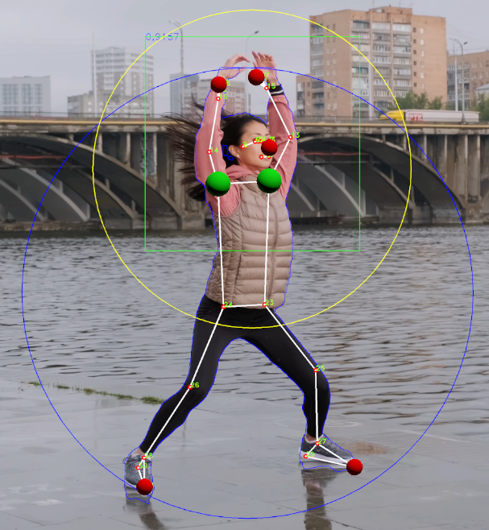

# OpenCV OCV-BodyPose-Tools

Open Computer Vision Body Pose Estimation with NDC coordinates and
static store data exchange.


```
private static ScreenLandmark[] _landmarks_screen; // = data.landmarks_screen;
private static Vector3[] _landmarks_world;
private static Vector3[] _landmarks_NDC;
```

# general tools

* Application Manager 3.2 https://github.com/nischelwitzer/OCV-BodyPose-Tools/blob/main/scripts/ApplicationManager32.cs
  with p..pause and s..screenshot
* Static Store https://github.com/nischelwitzer/OCV-BodyPose-Tools/blob/main/scripts/StaticStore.cs
* Cam Switch https://github.com/nischelwitzer/OCV-face68-Nose-Mouth-BB/blob/main/scripts/CamSwitchStore.cs
* Awake Kameras https://github.com/nischelwitzer/OCV-face68-Nose-Mouth-BB/blob/main/scripts/AwakeCamera.cs

# Pose Estimation Info Layers

Use this Files: https://github.com/nischelwitzer/OCV-BodyPose-Tools/tree/main/scripts/ShowLayers



## Parameter Selection


# OpenCV Draw Examples

* https://github.com/nischelwitzer/OCV-face68-Nose-Mouth-BB/blob/main/scripts/LogoUnity.cs
* https://github.com/nischelwitzer/OCV-face68-Nose-Mouth-BB/blob/main/scripts/LogoOpenCV.cs 

# see also OpenCV Face Detection

Code examples:
https://github.com/nischelwitzer/OCV-face68-Nose-Mouth-BB
and Script https://github.com/nischelwitzer/OCV-face68-Nose-Mouth-BB/tree/main/scripts 
