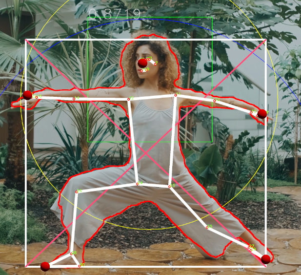

# OpenCV Show Layers

Show different OCV Info Layers on Poses.



* OCVShowPoseLayers.cs put this on the GameObject: CamRenderer
* Exchange:
  * MediaPipePersonDetectorDMT.cs
  * MediaPipePoseEstimatorDMT.cs
  * PoseEstimationDrawDMT.cs
  * and StaticStore.cs


## Bounding Box Calculation in MediaPipePoseEstimatorDMT

```
Point poseBBMin = new Point(9999, 9999);
Point poseBBMax = new Point(-9999, -9999);
for (int run = 0; run < landmarks_screen.Length; run++) // check all Points
{
    Vector3 screen = new Vector3(landmarks_screen[run].x, landmarks_screen[run].y, landmarks_screen[run].z);
    Point point = new Point(screen.x, screen.y);
    if (point.x > poseBBMax.x) poseBBMax.x = point.x;
    if (point.y > poseBBMax.y) poseBBMax.y = point.y;
    if (point.x < poseBBMin.x) poseBBMin.x = point.x;
    if (point.y < poseBBMin.y) poseBBMin.y = point.y;
}

DMT.StaticStore.myBoundingBox = new UnityEngine.Rect((float)poseBBMin.x, (float)poseBBMin.y, 
        (float)poseBBMax.x - (float)poseBBMin.x, (float)poseBBMax.y - (float)poseBBMin.y);
DMT.StaticStore.myBoundingBoxNDC = new UnityEngine.Rect(
  (float)poseBBMin.x / image.width(), (float)poseBBMin.y / image.height(),
  ((float)poseBBMax.x - (float)poseBBMin.x) / image.height(),
  ((float)poseBBMax.y - (float)poseBBMin.y) / image.height());

// draw white bounding box
if (DMT.StaticStore.ShowBoundingBoxLayer)
{
    Imgproc.rectangle(image, poseBBMin, poseBBMax, new Scalar(255, 255, 255), 10);
    Imgproc.line(image, new Point(poseBBMin.x, poseBBMin.y), new Point(poseBBMax.x, poseBBMax.y), new Scalar(255, 0, 0), 7);
    Imgproc.line(image, new Point(poseBBMax.x, poseBBMin.y), new Point(poseBBMin.x, poseBBMax.y), new Scalar(255, 0, 0), 7);
}
```
