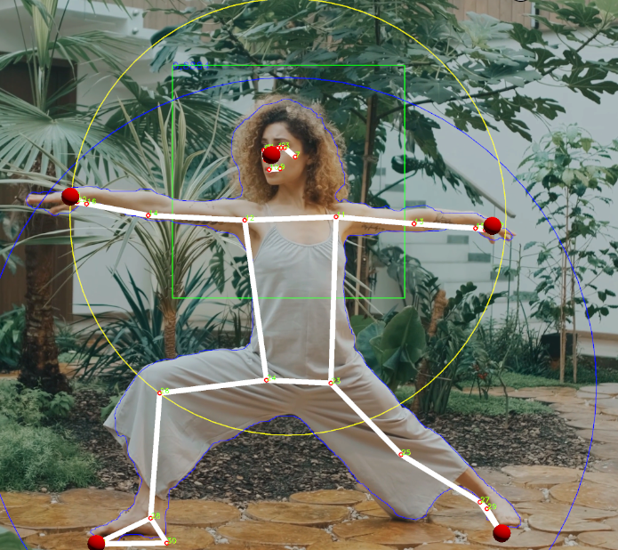
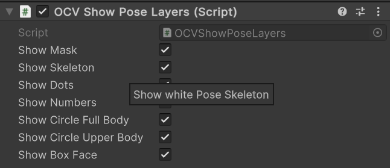

# OpenCV Show Layers

Show different OCV Info Layers on Poses.

* OCVShowPoseLayers.cs put this on the GameObject: CamRenderer
* Exchange:
  * MediaPipePersonDetectorDMT.cs
  * MediaPipePoseEstimatorDMT.cs
  * PoseEstimationDrawDMT.cs
  * and StaticStore.cs

