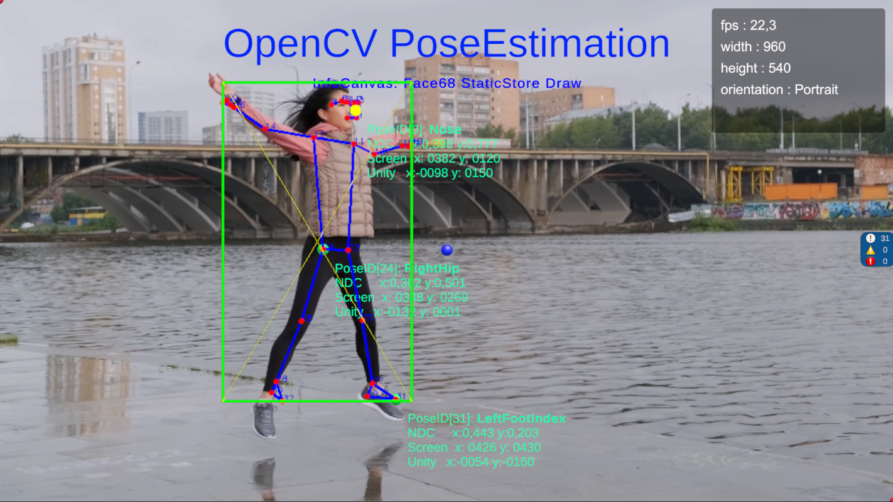

# OpenCV OCV-BodyPose-Tools

Open Computer Vision Body Pose Estimation with NDC coordinates and
static store data exchange.



```
// Human Pose Landmarks Points
private static ScreenLandmark[] _bodyPose_screen;
private static Vector3[] _landmarks_world;
private static Vector2[] _landmarks_NDC = new Vector2[39];
private static Vector2[] _landmarks_screen = new Vector2[39]; // must be initialized 0-39 

private static int _pose_counter = -1; // number of detected poses, -1 no webcam 
private static bool _pose_detected = false;
private static float _confidence; // pose confidence

private static UnityEngine.Rect _boundingBox = UnityEngine.Rect.zero;
private static UnityEngine.Rect _boundingBoxNDC = UnityEngine.Rect.zero;
```
